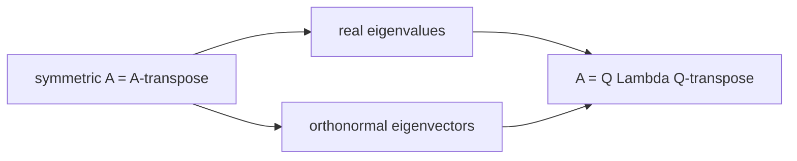

Symmetric Matrices & the Spectral Theorem

*(한국어: [대칭 행렬과 스펙트럼 정리 (Symmetric Matrices)](/portfolio/study/symmetric-matrix.ko/))*

> A=A^T has real eigenvalues and orthonormal eigenvectors: A = QΛQ^T (spectral theorem).

## Idea
A **symmetric matrix** satisfies $A=A^T$. The **spectral theorem** says its eigenvalues are
**real** and its eigenvectors can be chosen **orthonormal**, so
$$
A = Q\Lambda Q^T,\qquad Q\text{ orthogonal},\ \Lambda\text{ real diagonal}.
$$

## Why it matters
Symmetric matrices are the best-behaved: always diagonalizable, by an
[Orthogonal Matrix](/portfolio/study/orthogonal-matrix/). They model quadratic forms, covariance, and energy, and lead
directly to [Positive Definite Matrices](/portfolio/study/positive-definite/) matrices and the [Singular Value Decomposition (SVD)](/portfolio/study/singular-value-decomposition/).

## Details
- Signs of the eigenvalues = signs of the pivots (a quick test).
- $A^TA$ and $AA^T$ are always symmetric (positive semidefinite) — the source of the SVD.
- Distinct eigenvalues ⇒ eigenvectors automatically orthogonal.

## Diagram

## Related
[Positive Definite Matrices](/portfolio/study/positive-definite/) · [Orthogonal Matrix](/portfolio/study/orthogonal-matrix/) · [Singular Value Decomposition (SVD)](/portfolio/study/singular-value-decomposition/)
