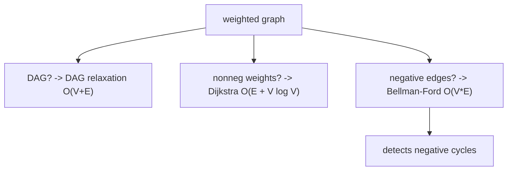

가중치 최단 경로: 개요 (Weighted Shortest Paths)

*(English: [Weighted Shortest Paths: Overview](/portfolio/study/weighted-shortest-paths/))*

> 소스에서 최소 가중치 경로를 찾는다; 알맞은 알고리즘은 간선 부호와 그래프 모양에 달려 있다.

## 개념
단일 소스 최단 경로: $s$ 에서 각 $v$ 까지 최소 총 가중치 $\delta(s,v)$ 를 계산한다. 통합 연산은
**완화(relaxation)**: $d[u]+w(u,v)<d[v]$ 면 $d[v]$ 갱신.

## 왜 중요한가
결정 틀이다: 그래프에 따라 알고리즘을 고른다. 음수 가중치 순환은 최단 경로를 미정의로 만들고,
이를 탐지하는 것이 중요하다(차익거래, 실행 불가능).

## 세부
구조로 선택: **DAG** $\to$ 위상 순서로 완화, $O(V+E)$; **음이 아닌 가중치** $\to$ Dijkstra,
$O(E+V\log V)$; **일반(음수 간선)** $\to$ Bellman-Ford, $O(VE)$, 음수 순환도 보고한다.

## 다이어그램

## 관련
[DAG 최단 경로 (완화) (DAG Relaxation)](/portfolio/study/dag-relaxation.ko/) · [벨만–포드 알고리즘 (Bellman–Ford)](/portfolio/study/bellman-ford.ko/) · [다익스트라 알고리즘 (Dijkstra's Algorithm)](/portfolio/study/dijkstra.ko/)
