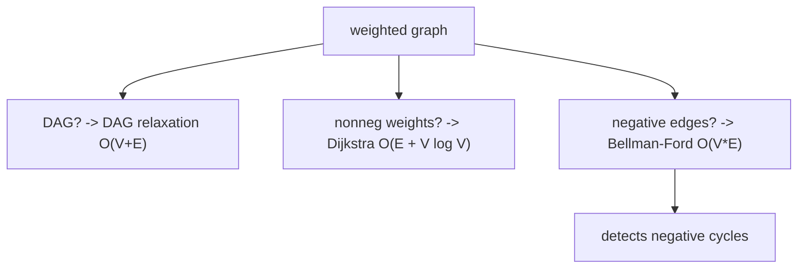

Weighted Shortest Paths: Overview

*(한국어: [가중치 최단 경로: 개요 (Weighted Shortest Paths)](/portfolio/study/weighted-shortest-paths.ko/))*

> Find minimum-weight paths from a source; the right algorithm depends on edge signs and graph shape.

## Idea
Single-source shortest paths: compute $\delta(s,v)$, the minimum total edge weight from $s$ to
each $v$. The unifying operation is **relaxation**: if $d[u]+w(u,v)<d[v]$, update $d[v]$.

## Why it matters
A decision framework: pick the algorithm by the graph. Negative-weight cycles make shortest
paths undefined; detecting them matters (arbitrage, infeasibility).

## Details
Choose by structure: **DAG** $\to$ relax in topological order, $O(V+E)$; **nonnegative
weights** $\to$ Dijkstra, $O(E+V\log V)$; **general (negative edges)** $\to$ Bellman-Ford,
$O(VE)$, which also reports a negative cycle.

## Diagram

## Related
[DAG Shortest Paths (Relaxation)](/portfolio/study/dag-relaxation/) · [Bellman–Ford Algorithm](/portfolio/study/bellman-ford/) · [Dijkstra's Algorithm](/portfolio/study/dijkstra/)
